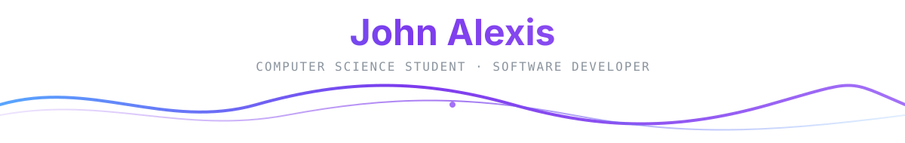

  

## 👩‍💻 About Me

I'm **John Alexis** from the Philippines.

- 🔭 I’m a computer science student and software developer
- 📚 I'm currently learning web development and graphic design
- 🚀 I like taking projects from **idea → design → implementation → testing → release**

  

## 🛠 Languages and Tools

  
  &nbsp;&nbsp;&nbsp;
  
  &nbsp;&nbsp;&nbsp;
  
  &nbsp;&nbsp;&nbsp;
  
  &nbsp;&nbsp;&nbsp;
  
  &nbsp;&nbsp;&nbsp;
  
  &nbsp;&nbsp;&nbsp;
  
  &nbsp;&nbsp;&nbsp;
  

  JavaScript · HTML · CSS · Python · React · Express · Node.js · MongoDB

### 🔧 Developer Tools

  
  &nbsp;&nbsp;&nbsp;&nbsp;
  
  &nbsp;&nbsp;&nbsp;&nbsp;
  
  &nbsp;&nbsp;&nbsp;&nbsp;
  

  Git · GitHub · Docker · Vercel

  

## 🚀 Featured Projects

Personal applications I've designed and built using an **AI-assisted development workflow**.

 

<h3>
  
  &nbsp; <a href="https://github.com/Johnkoder/rankfit-official">RankFit</a>
</h3>

A gamified Android workout timer with routines, XP, ranks, streaks, seasons, offline voice controls, and local backup/restore.

<a href="https://github.com/Johnkoder/rankfit-official">VIEW REPOSITORY ↗</a>

  

<h3>
  
  &nbsp; <a href="https://github.com/Johnkoder/book-rank-official">BookRank</a>
</h3>

An offline-first Android PDF reading tracker with bookmarks, reading statistics, ranks, achievements, and backup/restore.

<a href="https://github.com/Johnkoder/book-rank-official">VIEW REPOSITORY ↗</a>

  

<h3>
  
  &nbsp; <a href="https://github.com/Johnkoder/lock-in-official">Lock In</a>
</h3>

A local-first productivity and focus app with focus sessions, activity tracking, backups, and timelapse features.

<a href="https://github.com/Johnkoder/lock-in-official">VIEW REPOSITORY ↗</a>

  

<h3>
  
  &nbsp; <a href="https://github.com/Johnkoder/habit-rank-official">HabitRank</a>
</h3>

A gamified habit tracker built around habits, streaks, XP, ranks, achievements, and seasonal progression.

<a href="https://github.com/Johnkoder/habit-rank-official">VIEW REPOSITORY ↗</a>

  

## ⚡ GitHub Activity

  

  

