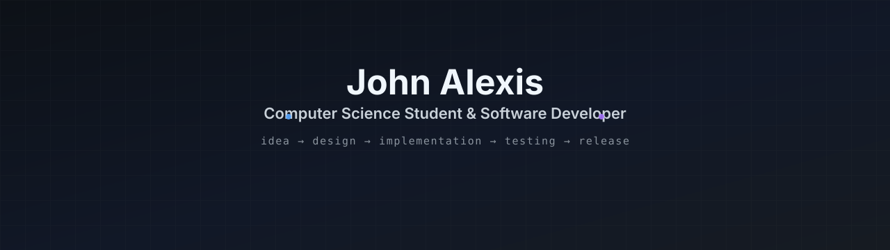
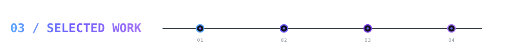

  

 

I'm **John Alexis** from the Philippines.

- 🔭 I’m a computer science student and software developer
- 📚 I'm currently learning web development and graphic design
- 🚀 I like taking projects from **idea → design → implementation → testing → release**

 

  
  &nbsp;&nbsp;&nbsp;
  
  &nbsp;&nbsp;&nbsp;
  
  &nbsp;&nbsp;&nbsp;
  
  &nbsp;&nbsp;&nbsp;
  
  &nbsp;&nbsp;&nbsp;
  
  &nbsp;&nbsp;&nbsp;
  
  &nbsp;&nbsp;&nbsp;
  

JavaScript &nbsp;·&nbsp; HTML &nbsp;·&nbsp; CSS &nbsp;·&nbsp; Python &nbsp;·&nbsp; React &nbsp;·&nbsp; Express &nbsp;·&nbsp; Node.js &nbsp;·&nbsp; MongoDB

 

<strong>🔧 Developer Tools</strong>

  
  &nbsp;&nbsp;&nbsp;&nbsp;
  
  &nbsp;&nbsp;&nbsp;&nbsp;
  
  &nbsp;&nbsp;&nbsp;&nbsp;
  

Git &nbsp;·&nbsp; GitHub &nbsp;·&nbsp; Docker &nbsp;·&nbsp; Vercel

 

Personal applications I've designed and built using an **AI-assisted development workflow**.

 

###  &nbsp; [RankFit](https://github.com/Johnkoder/rankfit-official)
A gamified Android workout timer with routines, XP, ranks, streaks, seasons, offline voice controls, and local backup/restore.

🏋️ &nbsp; [VIEW REPOSITORY ↗](https://github.com/Johnkoder/rankfit-official)

  

###  &nbsp; [BookRank](https://github.com/Johnkoder/book-rank-official)
An offline-first Android PDF reading tracker with bookmarks, reading statistics, ranks, achievements, and backup/restore.

📚 &nbsp; [VIEW REPOSITORY ↗](https://github.com/Johnkoder/book-rank-official)

  

###  &nbsp; [Lock In](https://github.com/Johnkoder/lock-in-official)
A local-first productivity and focus app with focus sessions, activity tracking, backups, and timelapse features.

⏱️ &nbsp; [VIEW REPOSITORY ↗](https://github.com/Johnkoder/lock-in-official)

  

###  &nbsp; [HabitRank](https://github.com/Johnkoder/habit-rank-official)
A gamified habit tracker built around habits, streaks, XP, ranks, achievements, and seasonal progression.

✅ &nbsp; [VIEW REPOSITORY ↗](https://github.com/Johnkoder/habit-rank-official)

 

  

 

  

