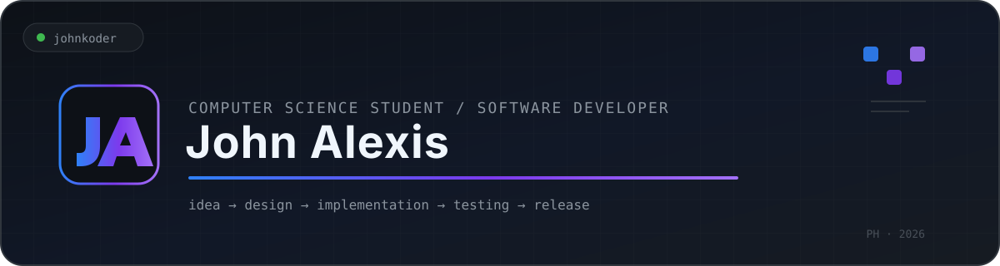

  

 

## 👩‍💻 About Me

I'm **John Alexis** from the Philippines.

> 🔭 I’m a computer science student and software developer  
> 📚 I'm currently learning web development and graphic design  
> 🚀 I like taking projects from **idea → design → implementation → testing → release**

 

## 🛠 Languages and Tools

  
  &nbsp;&nbsp;&nbsp;
  
  &nbsp;&nbsp;&nbsp;
  
  &nbsp;&nbsp;&nbsp;
  
  &nbsp;&nbsp;&nbsp;
  
  &nbsp;&nbsp;&nbsp;
  
  &nbsp;&nbsp;&nbsp;
  
  &nbsp;&nbsp;&nbsp;
  

  JavaScript &nbsp;·&nbsp; HTML &nbsp;·&nbsp; CSS &nbsp;·&nbsp; Python &nbsp;·&nbsp; React &nbsp;·&nbsp; Express &nbsp;·&nbsp; Node.js &nbsp;·&nbsp; MongoDB

### 🔧 Developer Tools

  
  &nbsp;&nbsp;
  
  &nbsp;&nbsp;
  
  &nbsp;&nbsp;
  
  &nbsp;&nbsp;&nbsp;
  <strong>Git</strong> · <strong>GitHub</strong> · <strong>Docker</strong> · <strong>Vercel</strong>

 

---

## 🚀 Featured Projects

Personal applications I've designed and built using an **AI-assisted development workflow**.

 

### `01` · 🏋️ [RankFit](https://github.com/Johnkoder/rankfit-official)
A gamified Android workout timer with routines, XP, ranks, streaks, seasons, offline voice controls, and local backup/restore.

**[View project →](https://github.com/Johnkoder/rankfit-official)**

 

### `02` · 📚 [BookRank](https://github.com/Johnkoder/book-rank-official)
An offline-first Android PDF reading tracker with bookmarks, reading statistics, ranks, achievements, and backup/restore.

**[View project →](https://github.com/Johnkoder/book-rank-official)**

 

### `03` · ⏱️ [Lock In](https://github.com/Johnkoder/lock-in-official)
A local-first productivity and focus app with focus sessions, activity tracking, backups, and timelapse features.

**[View project →](https://github.com/Johnkoder/lock-in-official)**

 

### `04` · ✅ [HabitRank](https://github.com/Johnkoder/habit-rank-official)
A gamified habit tracker built around habits, streaks, XP, ranks, achievements, and seasonal progression.

**[View project →](https://github.com/Johnkoder/habit-rank-official)**

 

---

### 🔥 GitHub Streak

  

BUILD · LEARN · ITERATE · SHIP

